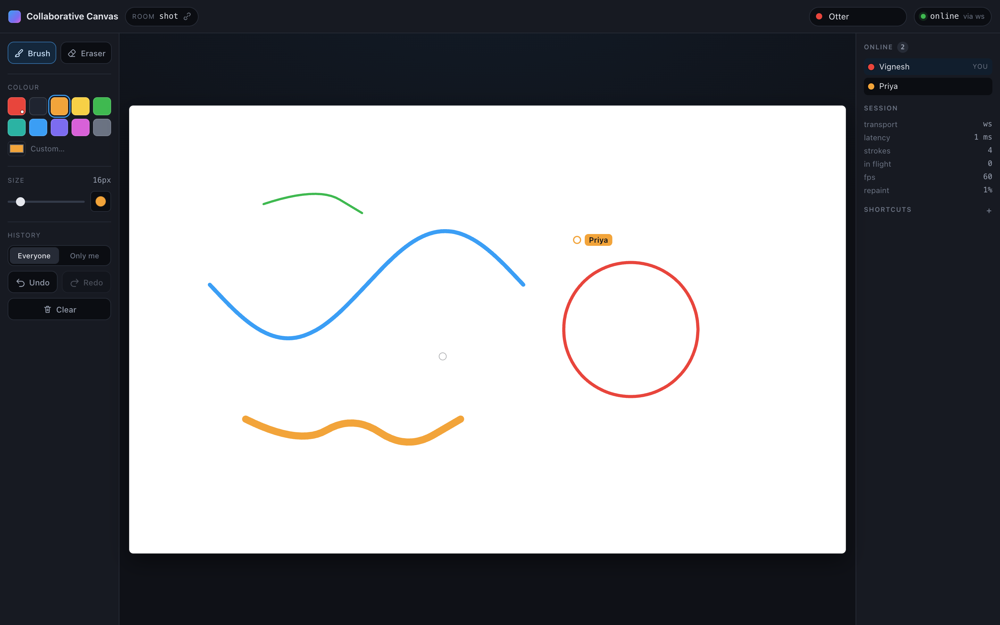

# Real-Time Collaborative Drawing Canvas

A multi-user drawing surface where several people draw at once and see each
other's strokes appear as they are drawn — not after they finish. Global undo,
per-user undo, live cursors, presence, and an eraser that actually erases.

Vanilla TypeScript and HTML5 Canvas on the frontend. No React, no Vue, no canvas
library, no CRDT library. Node + `ws` on the backend, plus a Server-Sent-Events
transport so the whole thing also deploys to Vercel with no configuration.



*Two browser windows in the same room: live strokes, presence, another user's labelled cursor, and the session stats. The `repaint` figure is the share of the surface the last frame actually touched.*

---

## Setup

Requires Node 20 or newer.

```bash
npm install
npm start
```

Then open **http://localhost:3000**.

`npm start` builds the client and the server and then runs it. The terminal also
prints a LAN URL (`http://192.168.x.x:3000`) — open that on a phone or a second
laptop to collaborate across devices.

| Command | What it does |
|---|---|
| `npm start` | build everything, then serve on :3000 |
| `npm run dev` | same, with the client, server and types all rebuilding on change |
| `npm test` | the whole suite — 177 tests, including real-browser end-to-end tests |
| `npm run test:server` | everything except the browser tests (no Chrome needed) |
| `npm run typecheck` | strict typecheck of both the server and the client |

Environment variables: `PORT` (default 3000), `HOST` (default 0.0.0.0),
`PUBLIC_WS_URL` (see [Deploying](#deploying)).

---

## Testing with multiple users

**Two windows, one machine.** Open http://localhost:3000 twice. Use two separate
windows rather than two tabs so both keep animating, and give each a different
*browser profile* (or one normal window and one private window) — identity is
stored per-browser-profile in `localStorage`, so two windows of the same profile
are treated as the same person reconnecting, and the older one is disconnected on
purpose.

**Different devices.** Use the LAN URL printed at startup. Phones and tablets work
— drawing uses Pointer Events, so touch and stylus behave like a mouse.

**Separate rooms.** `http://localhost:3000/?room=anything`. Each room is an
independent canvas. The room chip in the header copies an invite link.

**What to try:**

| | |
|---|---|
| Live streaming | Draw a slow, long stroke in window A. It appears in window B *while* you are still drawing, not when you let go. |
| Cursors | Move the pointer in A without drawing — a labelled ring tracks it in B. |
| Global undo | Draw in A, then press Ctrl/Cmd+Z **in B**. A's stroke disappears in both windows. That is the interesting case. |
| Per-user undo | Switch B's toolbar to **Only me**. Now B's undo only touches B's own strokes, and A's are untouched. |
| Concurrent undo | Draw one stroke in each window, then hit undo in both at the same moment. Exactly two strokes vanish — never the same one twice. |
| Eraser | `E`, then draw across someone else's stroke. It cuts a hole, and it is undoable like anything else. |
| Clear | Press Clear twice (the first click arms it). It clears for everyone — then press Ctrl+Z and the whole drawing comes back. |
| Reconnect | Kill the server with Ctrl+C while a window is open. The status chip goes to `reconnecting`. Restart with `npm run serve` and it reconnects and resyncs by itself. |
| Draw offline | Kill the server, keep drawing, then restart it. The strokes you drew while it was down are re-sent and appear for everyone — including one that was half-finished when the connection dropped. |
| Serverless transport | Add `?transport=sse` to the URL to force the Vercel transport locally. Everything works, with a little more latency. A WebSocket window and an SSE window can share the same room. |
| Load | Open four or five windows and scribble in all of them at once. Watch `fps` and `repaint` in the sidebar. |

**Keyboard:** `B` brush · `E` eraser · `[` `]` size · `Ctrl/Cmd+Z` undo ·
`Ctrl/Cmd+Shift+Z` redo · `Esc` abandon the current stroke.

---

## Deploying

### Vercel — zero configuration

```bash
npx vercel          # preview
npx vercel --prod   # production
```

Or import the repository at vercel.com. `vercel.json` is already in the repo:
`npm run build:client` produces `public/`, and `api/rt.ts` becomes the realtime
endpoint. Nothing to configure, no environment variables, no add-ons.

Since Vercel Functions cannot accept a WebSocket upgrade, the client detects this
and falls back to Server-Sent Events downstream with batched POSTs upstream. Same
protocol, same server code, a little more latency.

**Read this before demoing it to several people at once.** On Vercel the room
lives in the function instance's memory, so it is only consistent while a user's
stream and their POSTs land on the same warm instance. `regions: ["iad1"]` and
Fluid Compute request packing make that the normal case for a handful of users in
one room, and a request that lands elsewhere triggers a resync rather than silently
forking the canvas — but it is not a guarantee. For a demo it is fine. For anything
real, use the escape hatch below.

### Vercel + a real WebSocket server (fully consistent)

Deploy this same repo to any host that keeps a process alive — Render, Railway,
Fly.io, a VM — where `npm start` is the whole deployment. Then set one environment
variable on Vercel:

```
PUBLIC_WS_URL = wss://your-app.onrender.com/ws
```

Redeploy, and the static Vercel page connects straight to that server over a real
WebSocket. Single source of truth, full consistency, Vercel's CDN for the assets.

### Anywhere else

`npm install && npm start` behind a proxy that forwards WebSocket upgrades on
`/ws`. There is no database and nothing else to provision.

---

## How it works (short version)

The long version, with diagrams, the full protocol table and the reasoning behind
the undo design, is in **[ARCHITECTURE.md](ARCHITECTURE.md)**.

- **Every stroke is an operation in an append-only log.** The server assigns a
  global sequence number; that single total order is how every conflict is
  resolved.
- **Undo never deletes anything.** It flips one boolean, and the visible picture is
  *derived*: `!undone && seq > activeClearSeq`. Because visibility is a pure
  function of the log, two clients that received the same messages cannot disagree
  about the picture no matter what order the messages arrived in.
- **`shared/oplog.ts` runs on both the server and the browser**, so "is this
  stroke visible?" is answered by the same code on both ends.
- **Undo scope is a user choice.** Room-wide linear history (undo whatever
  happened last, whoever did it) or per-user (only my strokes). Undo stacks are
  validated lazily on pop, which is what makes two simultaneous undos resolve to
  two *different* operations instead of one double-undo.
- **Three canvas surfaces.** An offscreen raster of committed strokes written
  incrementally; an on-screen composite that blits only its dirty rectangle and
  then draws strokes still in flight; and an overlay for cursors. Committing a
  stroke is O(1) in history size, and an undo repaints one bounding box rather
  than replaying the log.
- **One transport interface, two implementations.** WebSocket, or SSE + POST for
  serverless. The protocol logic exists once.

---

## Testing

177 tests, no mocks of the things that matter — the WebSocket tests use a real
`ws` client against a real server on an ephemeral port, and the browser tests
drive real Chrome and assert on real canvas pixels.

```
npm test
```

| Suite | Tests | Covers |
|---|---:|---|
| `geometry` | 28 | RDP simplification and its determinism, bounds that never under-estimate, every input sanitiser |
| `oplog` | 16 | derived visibility, out-of-order arrival, clear/undo interaction, order-independence, compaction |
| `drawing-state` | 37 | undo scopes, concurrent undo, redo-branch truncation, limits, plus a 500-step randomised undo/redo storm that re-checks the invariants after every step |
| `client-state` | 26 | the browser's reconciliation logic, dirty-region derivation, history-gap detection |
| `integration-ws` | 37 | live streaming order, presence, reconnect deltas, superseded connections, rate limiting, malformed and oversized frames |
| `integration-sse` | 18 | the Vercel transport, including window expiry and reopen — and a WebSocket client sharing a room with an SSE client |
| `e2e-browser` | 15 | two real Chrome pages on one canvas: pixel-verified cross-user drawing, live streaming before commit, global and scoped undo, clear and restore, eraser, cursors, reload resync, resize — plus a server shaped exactly like Vercel (static files, one function, **no WebSocket endpoint**) where the client has to discover the fallback for itself |

The browser suite uses `playwright-core`, which downloads no browsers — it drives
the Chrome already on the machine, and skips cleanly if there is none, so
`npm test` still passes on a bare CI box. `npm run test:server` is the
browser-free subset.

Those tests earned their keep. Three real bugs came out of them:

- the pixel assertions caught an undo that left an antialiased fringe behind,
  because bounding boxes are padded in *world* units and that is less than one
  device pixel when the paper is displayed small;
- the Vercel-shaped harness caught relative asset URLs 404ing on a path-style
  room link;
- the reconnect test caught a stroke begun while offline being sent twice after
  reconnecting — once under its new id and once under the abandoned one, leaving
  a half-stroke stuck on everyone else's screen forever. (That test was checked
  by reverting the fix and watching it fail, which is the only way to know a
  regression test works.)

---

## Known limitations

**By design**

- **No authentication.** `clientId` is generated by the browser and stored in
  `localStorage`; anyone can claim any id. Rooms are public to anyone with the
  link. Fine for an open whiteboard, not for anything private.
- **Needs an authoritative server** — no peer-to-peer or offline-first mode. The
  payoff is that ordering and undo semantics are simple and testable.
- **Rooms are in memory.** A server restart loses the drawing. State survives an
  empty room for 30 minutes, and a user's colour and name for 10, so refreshes and
  brief disconnects are safe.
- **Bounded history:** 5000 ops / 300k points per room. When the budget runs low
  and a clear is active, the ops hidden behind that clear are compacted away — no
  pixel changes, but undo can no longer reach past the last clear. If nothing is
  hidden, nothing is dropped and new strokes are refused with an explanatory
  message instead.
- **One width and colour per stroke.** Pressure sensitivity would need a per-point
  width on the wire and a variable-width path renderer.
- **Fixed 1600×1000 drawing area**, aspect-fitted to the window. Everybody sees the
  same picture at any window size; there is no pan or zoom.

**Rough edges**

- **Vercel multi-instance consistency is best-effort** (see
  [Deploying](#deploying)). `PUBLIC_WS_URL` is the guaranteed path.
- **Two windows of the same browser profile are one user.** The second connection
  supersedes the first, which is correct behaviour for a reconnect but surprising
  if you meant to test with two users. Use separate profiles or a private window.
- **The SSE fallback adds latency** — a POST round-trip per batch instead of a
  push, so ~50–150ms more than a WebSocket, and the stream reopens every ~50
  seconds (invisibly, but it happens).
- **A remote stroke can shift by a fraction of a pixel** at the moment it commits,
  when the server's simplified path replaces the streamed preview. Visible only if
  you are looking for it at a large brush size.
- **Undo/redo buttons are enabled from what the client can see,** not from the
  server's stacks, so a button can occasionally be enabled when the server has
  nothing left to do. You get a toast instead of a state change.
- **`iPadOS Safari` Apple Pencil hover** is not used; the local brush ring only
  follows actual pointer positions.

---

## Time spent

Built in one continuous session on 12 September 2026, **21:35 → 22:35 local time
— almost exactly one hour**, from `git init` on an empty directory to the state in
this tree. The commit timestamps are the record; about 8,100 lines of TypeScript,
CSS and HTML, of which roughly a third is tests.

Roughly how it divided:

| | |
|---|---|
| Protocol, op log, undo engine, rooms, hub | ~16 min |
| Both transports (WebSocket server, SSE/POST + Vercel function) | ~8 min |
| Node test suite, written alongside the code rather than after it | ~12 min |
| Browser client — renderer, input, transport, UI, build pipeline | ~20 min |
| Browser end-to-end tests, and the three real bugs they found | ~12 min |
| README + ARCHITECTURE | ~12 min |

It was written by Claude (Opus 5) driving a terminal, running the suite at each
step rather than at the end. That is why the bugs listed under
[Testing](#testing) were caught by the tests instead of by a reviewer — and why
the last of them was verified by reverting the fix to watch the test fail.

---

## Project layout

```
collaborative-canvas/
├── client/
│   ├── index.html          app shell
│   ├── style.css           dark chrome, white paper, responsive down to phones
│   ├── canvas.ts           rendering: three surfaces, dirty rectangles, smoothing
│   ├── drawing.ts          pointer capture, thinning, batching, prediction
│   ├── websocket.ts        transport: WebSocket or SSE+POST, reconnect, RTT
│   ├── state.ts            state mirror -> minimal render effects (DOM-free)
│   ├── ui.ts               toolbar, presence, stats, toasts
│   ├── config.ts           room/identity/runtime config
│   └── main.ts             layout, frame loop, wiring
├── server/
│   ├── server.ts           Express + WebSocket server
│   ├── rooms.ts            room and presence management
│   ├── drawing-state.ts    authoritative canvas state + undo engine
│   ├── hub.ts              transport-agnostic protocol dispatch
│   └── serverless.ts       SSE + POST transport
├── shared/                 code that runs on both sides
│   ├── protocol.ts         wire types and constants
│   ├── oplog.ts            the op log and the visibility rule
│   └── geometry.ts         simplification, bounds, sanitisers
├── api/rt.ts               Vercel function (wraps server/serverless.ts)
├── test/                   177 tests
├── scripts/                build and dev runners
├── vercel.json
├── README.md
└── ARCHITECTURE.md
```

MIT licensed.
